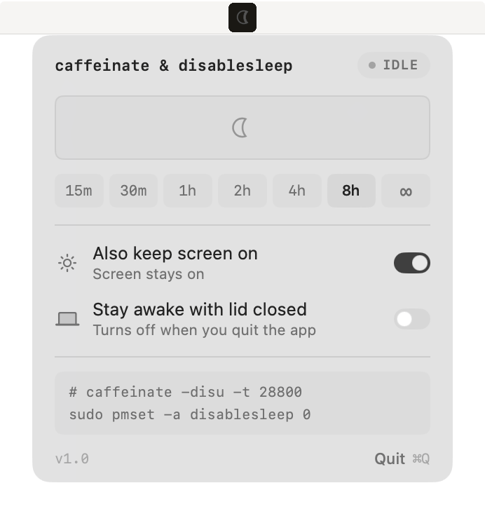
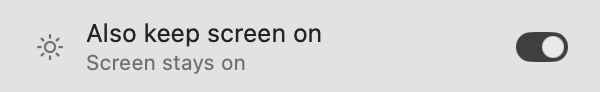
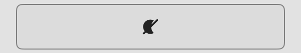
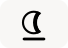

# caffeinate & disablesleep

 [](https://github.com/sponsors/demiaochen)

<p align="center">
  
</p>

A tiny macOS menu bar app that keeps your Mac awake.

Start a timed session, keep the screen on, or let the Mac keep working with its
lid closed. It replaces `caffeinate` and `pmset disablesleep` with a few simple
controls.

## Install

Download the DMG from [Releases](../../releases), or install it with Homebrew:

```sh
brew install --cask demiaochen/tap/caffeinate-disablesleep
```

Requires macOS 14 or later.

## Using the app

<p align="center">
  <picture>
    <source media="(prefers-color-scheme: dark)" srcset="shots/demo-dark.gif">
    
  </picture>
</p>

Open the app from the menu bar, then choose how long the Mac should stay awake.
Picking a duration starts the session immediately. Choose `∞` to keep it awake
until you stop it.


The screen can still turn off during a session. Turn on **Also keep screen on**
if you want the display to remain lit.



Click the large moon button to start or stop the selected session. You can also
right click the menu bar icon to toggle it without opening the panel.



Press ⌘, or click the version number to open settings. That is where you turn
on **Turn on when app opens** and **Open app at login**, manage the lid
permission, and find the source.

## Keeping the Mac awake with its lid closed

A normal awake session does not prevent sleep when the lid is closed. Turn on
**Stay awake with lid closed** when the Mac needs to keep running while shut.


This is a separate system setting. It remains on until you turn it off or quit
the app, even if a timed session ends.

macOS asks for an administrator password the first time you enable it. The app
installs a restricted sudoers rule so later changes do not need another
password. The rule only permits turning `disablesleep` on and off.

You can remove that permission, or install it up front, with the **Lid
permission** switch in settings (⌘, or click the version number).

A closed Mac can trap heat while it is running. Make sure it has ventilation.

See [SECURITY.md](SECURITY.md) for the exact permission and removal
instructions.

## What the menu bar icon shows

The icon is the whole status, readable without opening the panel.

| Icon | Meaning |
| --- | --- |
|  | Idle. Nothing is keeping the Mac awake. |
|  | A session is running and the screen stays on. |
|  | A session is running, but the screen can still sleep. |
|  | The dot means a timer is running. |
|  | The underline means the lid setting is on. |

The strike means awake. A filled moon means the screen is held on, a hollow one
means it is not. The dot and the underline stack on top of either.

## Under the hood

Awake sessions use the same macOS power assertions as:

```sh
caffeinate -disu
```

The app holds these assertions itself. It does not start a separate
`caffeinate` process. If the app exits, macOS releases them automatically.

The lid option changes:

```sh
sudo pmset -a disablesleep 1
```

It restores the value to `0` when you turn the option off or quit normally.

The command readout at the bottom of the panel shows the current equivalent
commands. It also follows changes made from Terminal.

The app uses no polling while its panel is closed. It has zero idle CPU usage
and is about a 1 MB universal binary.

## Build

```
scripts/build.sh      # compile + sign           (set CODESIGN_IDENTITY)
scripts/lint.sh       # swift-format check       (--fix to rewrite)
scripts/release.sh    # notarize + staple + DMG  (set NOTARY_PROFILE)
```

macOS 14+. No Xcode project, no dependencies, just plain `swiftc`.

## License

[MIT](LICENSE)

## Sponsor

If this app saves you a terminal tab, you can keep me awake too:

[](https://ko-fi.com/demiaochen)
